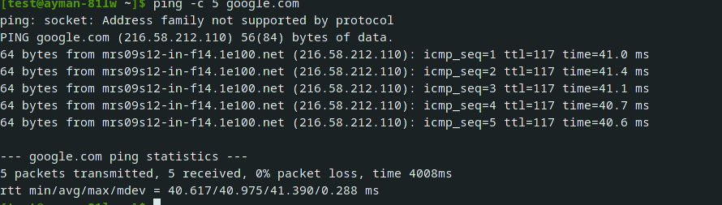
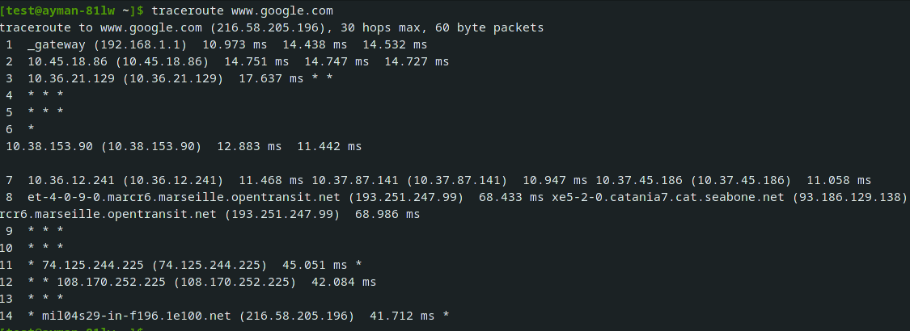
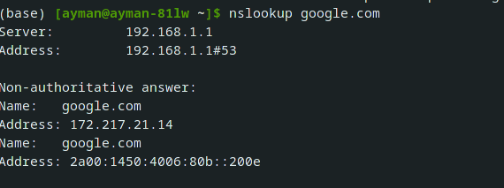
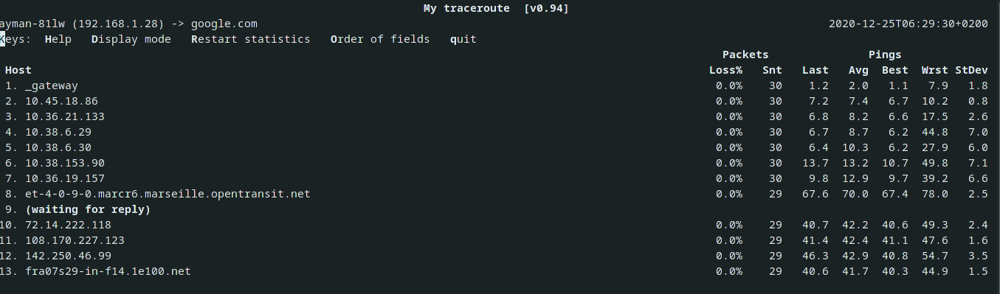
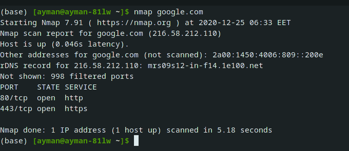
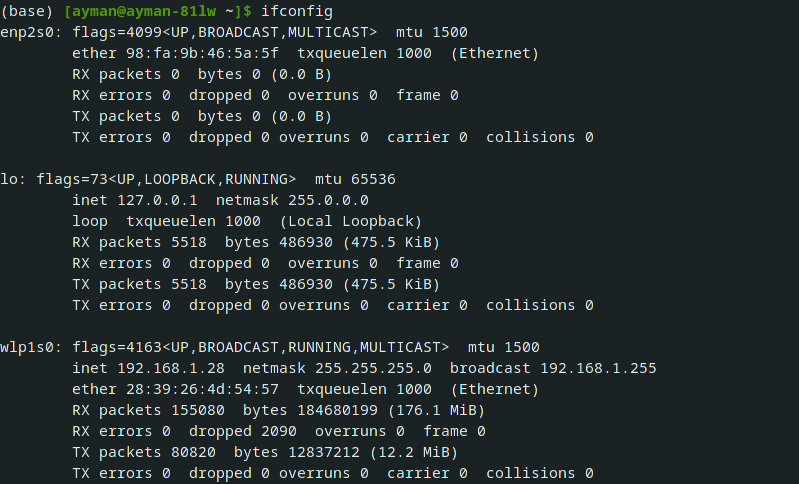
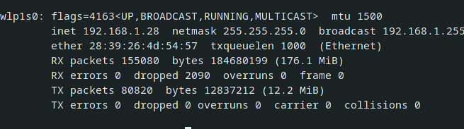

## SSH:
It stands for Secure SHell You can use it to connect to remote device. To connect to a server you should know its address(ip) or name (DNS server will resolve the name to ip address) and have a user on it
### installation:
we will use openssh as it's considered the standart now
### depian distro:
sudo apt install openssh-server
### fedora
sudo dnf install -y openssh-server
### arch
it comes installed by defult
### usage with some examples:
the main syntax for ssh is 
``ssh <user_name>@<host> -p <port_number>(default 22)``
ssh-> //the name of the pkg
<user_name> -> //the username on that host
@<host> -> //the name of the host
-p -> //to use custom port
example:
``ssh username@remotehost`` or ip address //login into other machine
ssh servername //login as your username into the server
also if you typed the name of the server only it will use the current user_name in that host
to end your session just type ctrl+d to logout
ctrl +d //to logout.
## config ssh:
you may want to edit some changes into how ssh behave on the host machine so in order to edit you will have to navigate through sshd_config file int etc folder
``nano /etc/ssh/sshd_config``  //to config ssh settings manually but you will have to super user in order to change the file
## use ssh-keygen to encrypt your connection
This command used to create a public and private key. You can you thoses keys with ssh to connect the server instead the password. It's more secure than password text.
### usage :
``ssh-keygen -t <encryption algorithm>``
the most well known encryption algorithm is RSA which we will use 
``ssh-keygen -t rsa`` //to generate some sort of enc. key
then it will ask us to enter the password then it will generate 2 files under ``.ssh/`` directory
the public key which will be sent to the host so it can reconize our machine
and to do that we will use ``scp`` command which is basiclly ``cp`` command but for ssh server
``cp <the file in our machine> <user_name@server_name/ip:path_in_server>``
we need to copy the public key to the server and put it in ***.ssh/authorized_keys*** file. If it doesn't exist, create it.
After that we will go to ``/etc/ssh/sshd_config`` and change 3 things to **no** :

1. challengeresponseauthentication no
2. passwordauthentication no
3. usepam no
then restart the ssh server by typing 
``sudo service ssh restart``
## PING
This command tests the connectivity between 2 hosts.
We can use ``ping`` with ``-c`` option to specifiy the number of package will be sent. ``ping -c 5 www.google.com``

## Traceroute

This command show you the road to reach the host and the number of hops it passes through.

``traceroute www.google.com``

## NSLOOKUP

This command searches for the ip of the given name

``nslookup www.google.com``

## MTR

This command combines the functionality of the traceroute and ping programs in a single network diagnostic tool.

``mtr www.google.com``

## Hostname

This command is for showing and changing the hostname

To show the hostname : ``hostname``

To change the hostname: ``hostname <new name>``

> **Note:** this name will last until you close or reboot the system. To make it permanently you should write the new name in ``/etc/hosts`` and ``/etc/hostname`` files.
## NMAP

This command is port scanner

Let's scan google ports : ``nmap www.google.com``

>**Importan Note:** every command has options, try to have fun with these options and search for them in man pages.
## WGET
wget is your universal command to download anything from the web
### usage:
``wget [options] [url]``
you can see the full wget options using ``wget --help``
for example:
``wget -o [name] [url]`` //gives you the ability to change the downloaded file name
``wget -p [location] [url]`` //makes you change your download location
``wget -c [url]`` //to resume download
``wget -i [txt file]`` //to download multiple files from plane txt file
``wget -m [url]`` //to mirror website into your machine
## Curl
Curl is more a web development tool than a linux tool since it mainly used to test rest apis and to get informations from the website such as the api which is used headers and alot more informations which is not very Importan unless you want to be a web developer 
you can learn more from [here](https://curl.se/docs/httpscripting.html)
## ifconfig
It stands for InterFace CONFIGurator

This command will give you some useful information about a network.

**like:** your internal ip address (you can assign a new ip address with this command too), mac address, MTU(Maximum Transmission Unit) size and also you can enable or disable a network.

When you type ``ifconfig``
It will provide you with 2+n interfaces information.

**eth0 ->**     This for wired network
**lo ->**         This for the internal device network. [For more about lo](https://www.webopedia.com/TERM/L/loopback.html)
**wlanxx ->** This for wifi network
lets start with **wlan0**:

- **UP ->** it's enabled
- **BROADCAST ->** it supports broadcasting
- **RUNNING ->** it's operating
- **MULTICAST ->** it supports multicasting
- **MTU ->** the size of transmission unit (frame/packet)
- **INET ->** the local network ip
- **NETMASK ->** the netmask for the network. [for more info](https://github.com/Open-Source-Community/OSC19-Linux-Workshop-Sessions/blob/master/Session%234Part1.md#subnet-masking)
- **BROADCAST ->** the broadcast address
### Assigning IP

``ifconfig <interface_name> <new_ip> netmask <netmask_address>``

> **Note:** this will last until you close or reboot the system

***To active or inactive interface : *** ``sudo ifconfig <interface_name> up/down``

